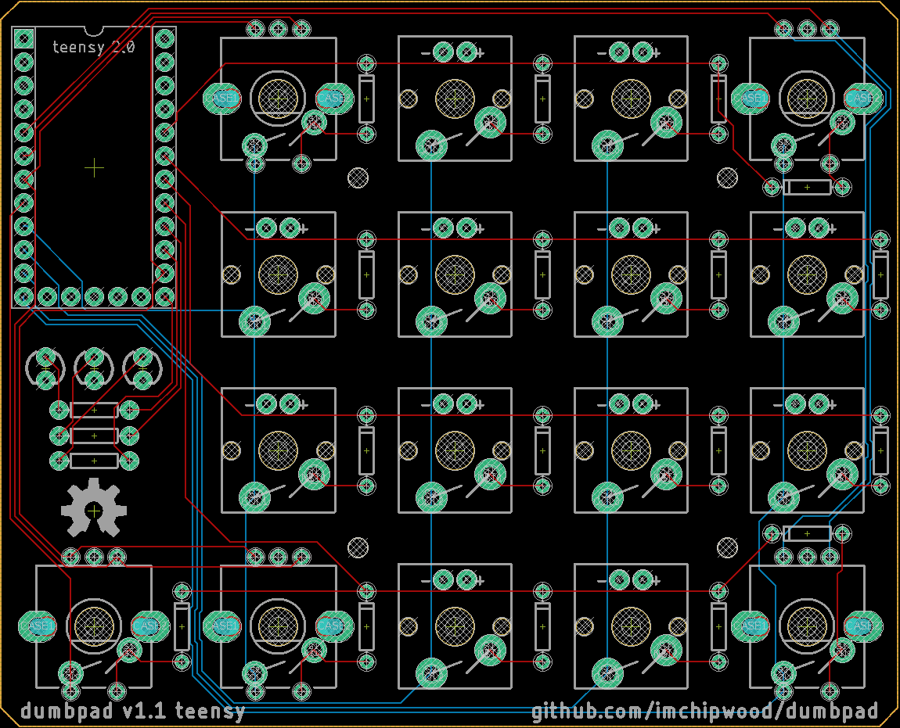

# dumbpad

Single-encoder version:

Dual-encoder version:

dumbpad-dualencoder is a simple 4x4 macro/numpad with two rotary encoders. It is designed for the ATmega32u4-based Pro Micro running [QMK firmware](https://github.com/qmk/qmk_firmware).

The EC11 rotary encoders used have a push-button, so they also act as regular switches. This dualencoder version is a custom layout similar to the [BDN9](https://keeb.io/products/bdn9-3x3-9-key-macropad-rotary-encoder-support)

The Cherry-style switch sockets are reversible - the switches can be soldered to either side of the PCB.

## Parts
* 14x Cherry-style mechanical switches
* 16x 1n4148 diodes (thru hole)
* 2x EC11 rotary encoder (7-pin)
* 1x Pro Micro ATmega32u4
* (optional) 1x 6mm tactile switch (to reset MCU - not needed most of the time as QMK has a RESET keycode)
* (optional) 2x 3mm LEDs (any color)
* (optional) 2x 220ohm or similar resistors for the LEDS (not needed if not adding LEDs)

## Making the PCB
https://www.oshpark.com is the recommended service for creating PCBs for folks in North America. 3x PCBs is roughly $60 from them. Simply upload the .brd file to create the project and order.
